# Enterprise Disaster Recovery & Backup Architecture Documentation 
## 1. Project Overview

Project Name: Enterprise Disaster Recovery & Backup Architecture
Domain: Storage + Backup + Disaster Recovery

### Objective:
Design and implement a disaster recovery solution to achieve:

RPO (Recovery Point Objective): 1 Hour
RTO (Recovery Time Objective): 4 Hours

### Solution Includes:

EC2 workload backup
Shared file storage (EFS)
Hybrid on-premises integration
Cross-region disaster recovery

## 2. Architecture Description
 Regions Used:

Primary Region: us-east-1

DR Region: us-west-2

### Components:
EC2 Instances (Application Layer)

EBS Volumes (Block Storage)

EFS (Shared File System)

AWS Backup (Centralized Backup)

S3 Bucket (DR Storage with CRR)

### 3.  Architecture Flow
On-premises data is written to Storage Gateway (File Gateway)

Data is stored in S3 bucket (Primary Region)

S3 Cross-Region Replication (CRR) replicates to DR region

### EC2 instances use:

EBS volumes (Multi-Attach)

EFS (shared storage)

### AWS Backup takes:

Hourly EBS snapshots

Daily EFS + AMI backups

Backups are copied to DR region vault

### 4.  Implementation Steps

## Step 1: EC2 Setup
Launch 2 EC2 instances in 2 Availability Zones

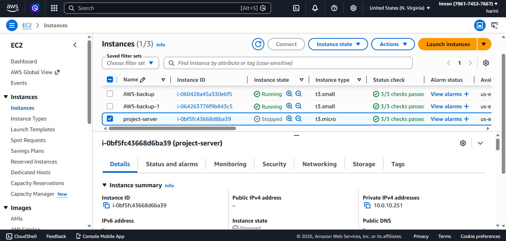

### Install required packages:

sudo apt update

sudo apt install nfs-common -y

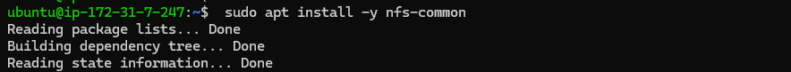

## Step 2: EBS Multi-Attach Setup

Create EBS Volume

Type: gp3

Size: 20 GB

Enable Multi-Attach

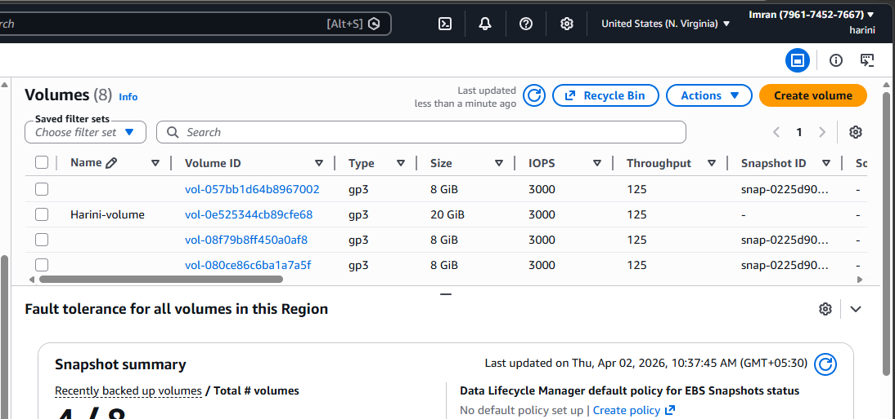

Attach to 2 EC2 Instances

    lsblk

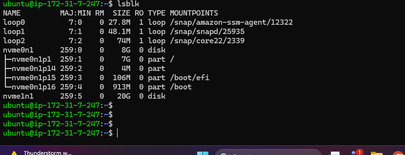

     sudo mkfs -t ext4 /dev/nvme1n1

     sudo mount /dev/nvme1n1 /data

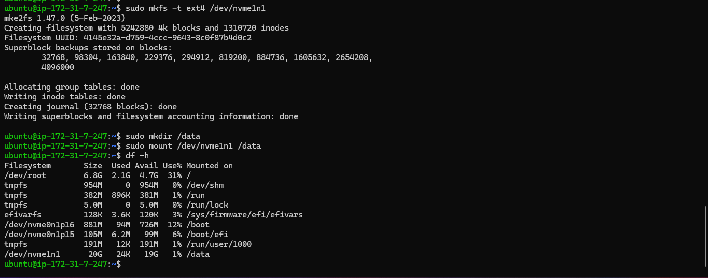

## Verified no downtime during resize

### Step 3: EFS Setup

Create EFS File System

Enable mount targets in 2 AZs

Mount on EC2

    sudo mount -t nfs4 fs-xxxx:/ /mnt/efs

Lifecycle Policy

Move to IA after 30 days

Move to Archive after 90 days

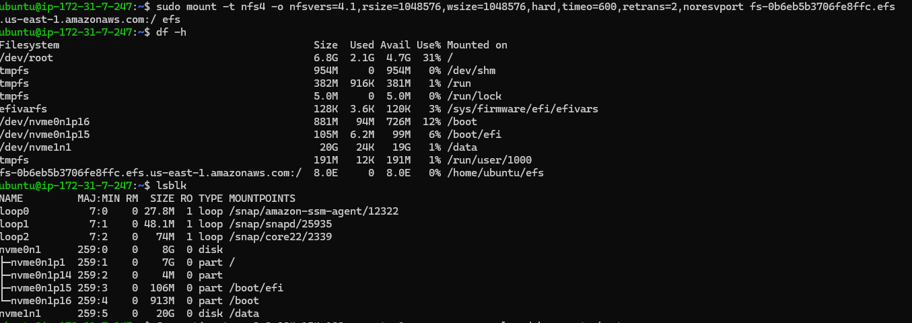

## Step 4: AWS Backup Configuration

Create Backup Vault

Enable KMS Encryption

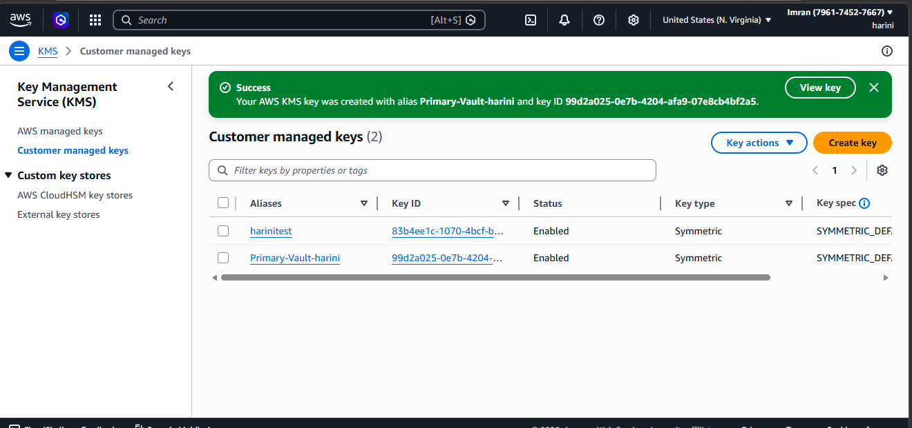

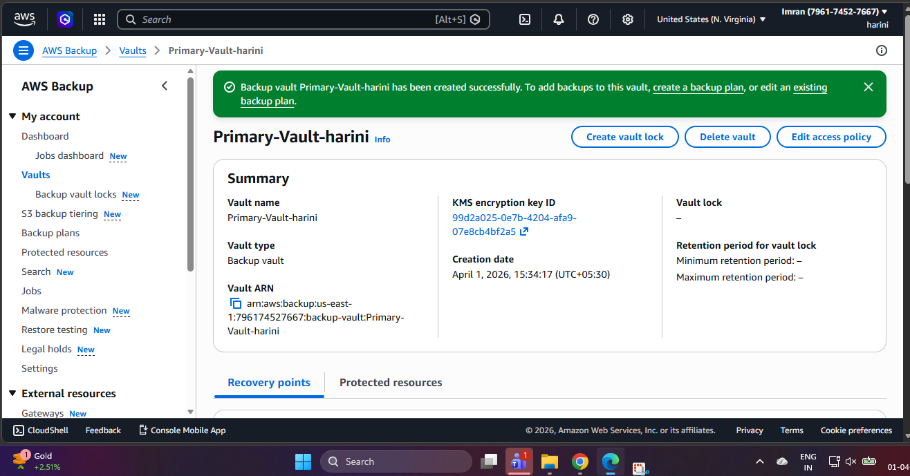

### Create Backup Plan:

Resource	Frequency	Retention

EBS	Hourly	24 Hours

EFS	Daily	30 Days

AMI	Daily	30 Days

Cross-Region Copy

Destination: us-west-2

Retention: 1 Year

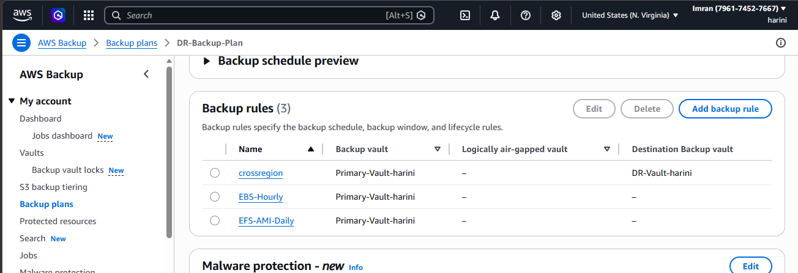

## Step 5: S3 Cross-Region Replication (CRR)

### Create:

Source bucket (Primary region)

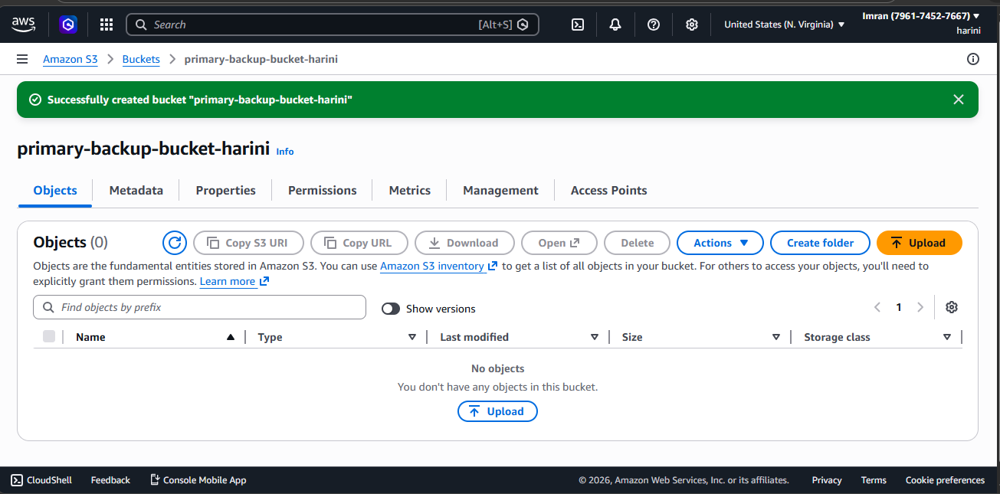

Destination bucket (DR region)

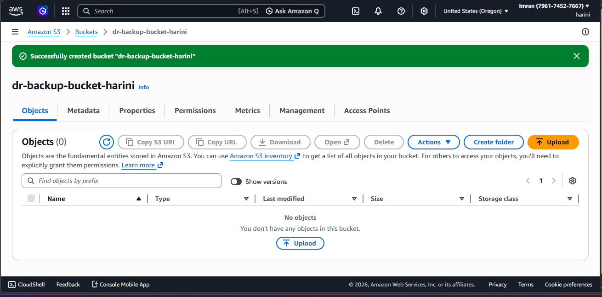

Enable versioning on both buckets

Configure CRR rule

 Verified replication success

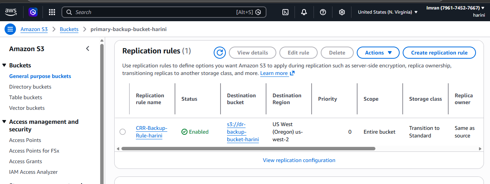

uploaded data in source bucket 

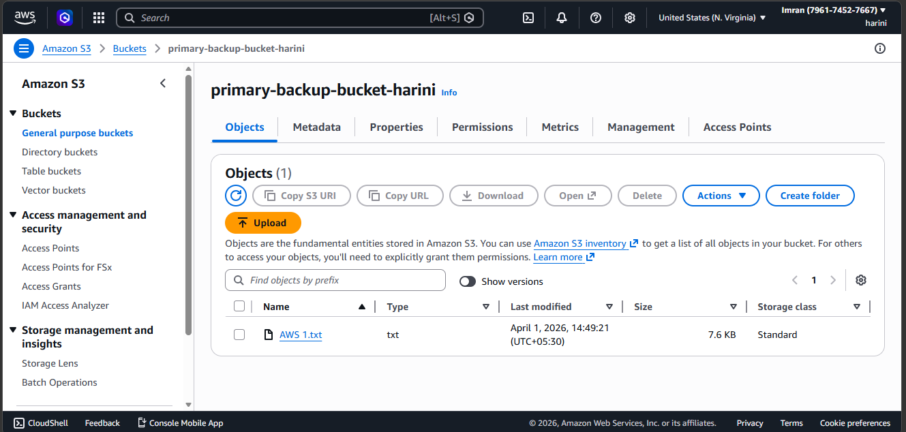

reflecting it in destination bucket

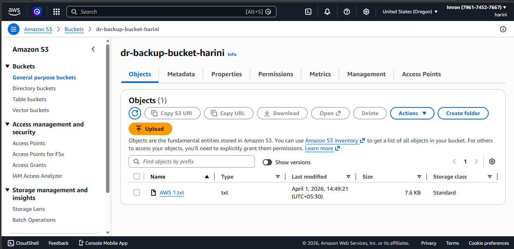

### 5.  Validation & Testing

Backup Validation

Trigger manual backup from AWS Backup

Confirm job completion

Disaster Simulation

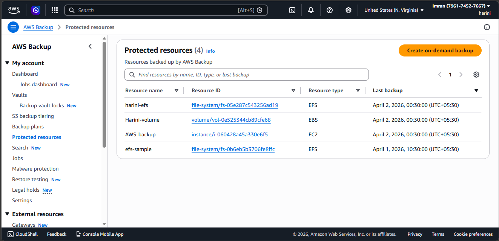

### 9. Conclusion

This architecture successfully meets business requirements by:

Ensuring data durability

Providing high availability

