# Multi-Region Microservices Platform (Step-by-Step)

We’ll build this in phases, just like a real AWS deployment.

## PHASE 0: Architecture Overview

Components you will create:

Frontend → S3 Static Website

API → EC2 (Auto Scaling + Placement Group)

Auth Service → Lambda

Routing → ALB (Path-based)

Scaling → Step Scaling Policies

Networking → VPC + Subnets + ENIs

## PHASE 1: VPC & NETWORK SETUP

### Step 1: Create VPC

CIDR: 10.0.0.0/16

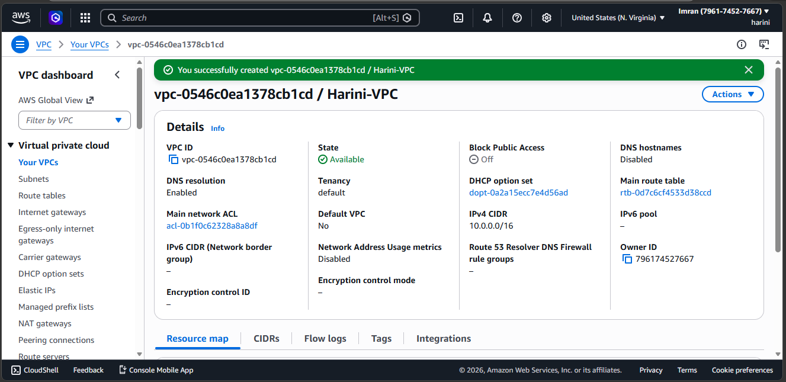

### Step 2: Create Subnets

  Type	    Example CIDR	   AZ

Public-1	10.0.1.0/24	   us-east-1a

Public-2	10.0.2.0/24	   us-east-1b

Private-1	10.0.3.0/24	   us-east-1a

Private-2	10.0.4.0/24	   us-east-1b

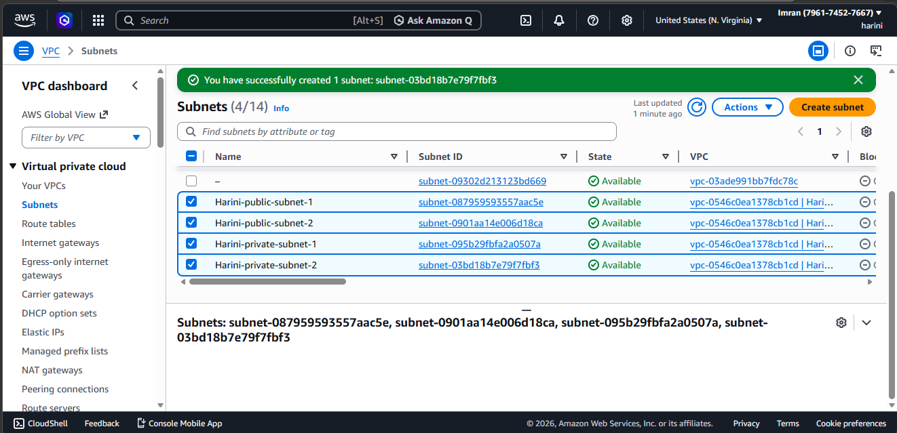

### Step 3: Internet Gateway

Attach to VPC

Route public subnet → IGW

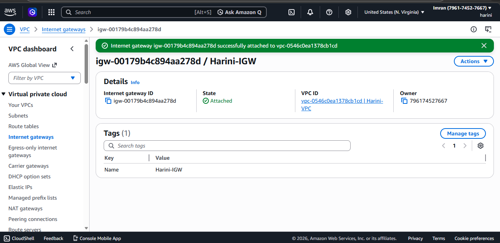

## PHASE 2: S3 FRONTEND (STATIC WEBSITE)

### Step 1: Create Bucket

Name: my-microservices-frontend-harini

Disable Block Public Access

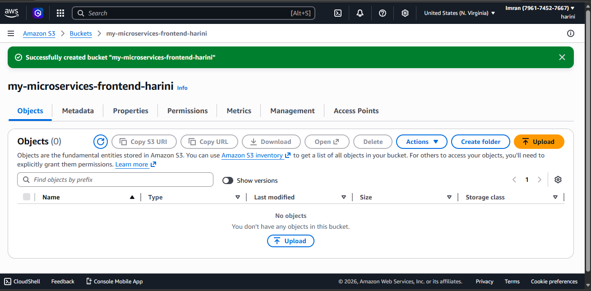

### Step 2: Enable Static Hosting

Index: index.html

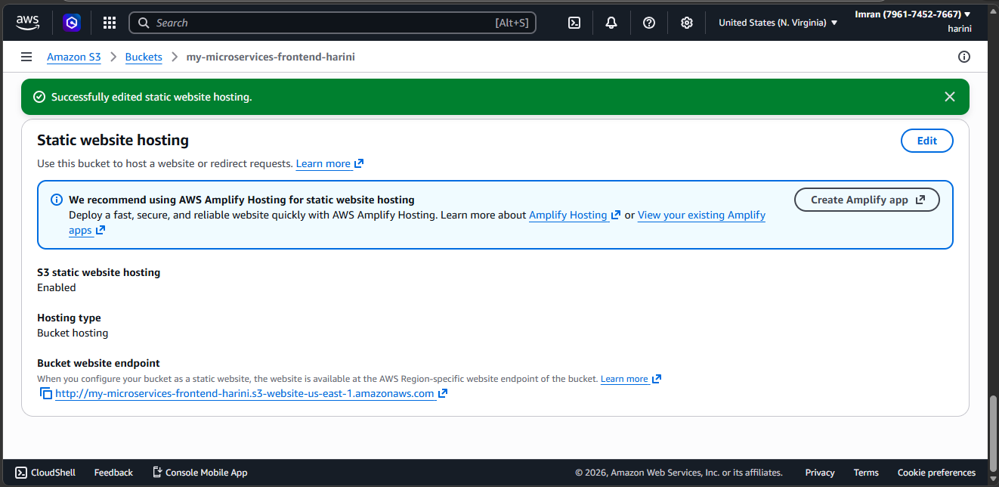

### Step 3: Bucket Policy

Allow public read:

    {
      "Version": "2012-10-17",
      "Statement": [
        {
          "Sid": "PublicRead",
          "Effect": "Allow",
          "Principal": "*",
          "Action": "s3:GetObject",
          "Resource": "arn:aws:s3:::my-microservices-frontend/*"
        }
      ]
    }

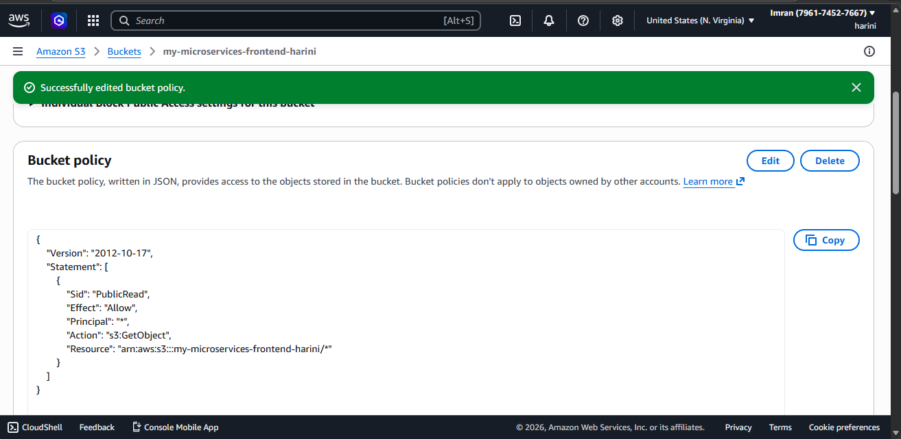

### Step 4: Configure CORS

    [
      {
        "AllowedOrigins": ["*"],
        "AllowedMethods": ["GET", "POST"],
        "AllowedHeaders": ["*"]
      }
    ]

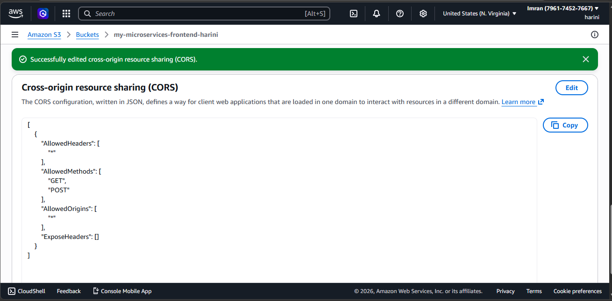

### Step 5: Upload Website Files
 1. Go to Objects tab

Click Upload

 2. Add files:

index.html

CSS, JS files

3. Click Upload

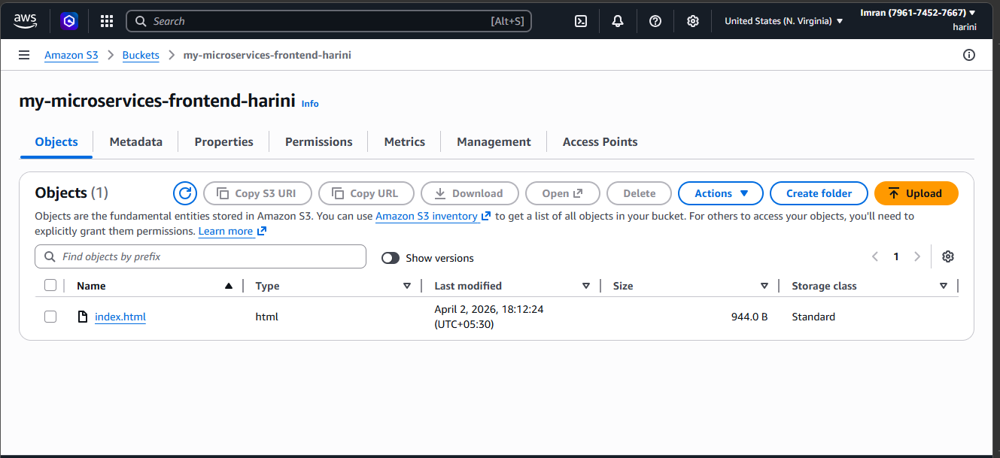

### Step 6: Access Your Website 

1. Go to Properties → Static Website Hosting

You will see:

Bucket website endpoint URL

Example:

    http://my-microservices-frontend-harini.s3-website-us-east-1.amazonaws.com

2. Open in browser

👉 Your frontend should load 🎉

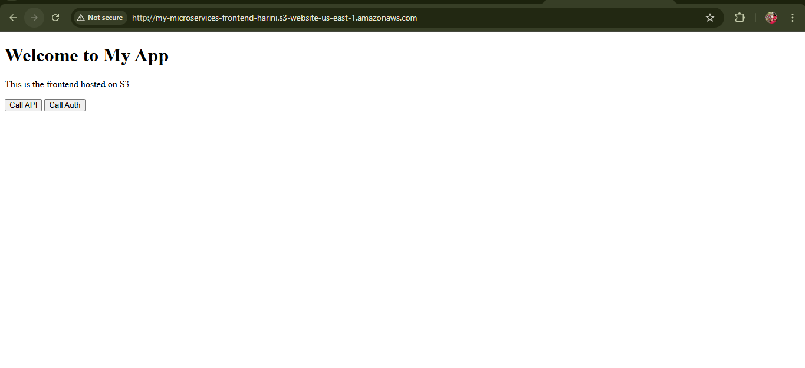

## PHASE 3: EC2 API LAYER

### Step 1: Create Placement Group

Type: Spread Placement Group

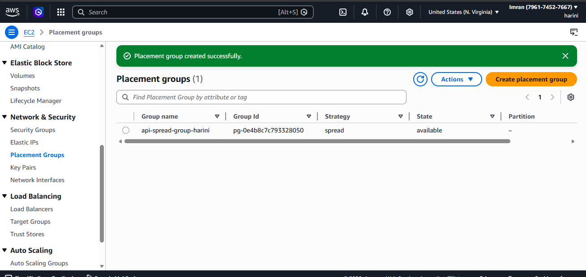

### Step 2: Launch Template

AMI: Ubuntu

Instance Type: t2.micro (or t3)

Network:

Private Subnet

Add User Data:

    #!/bin/bash
    apt update -y
    apt install -y nginx
    echo "API Service Running" > /var/www/html/index.html
    systemctl start nginx
    systemctl enable nginx

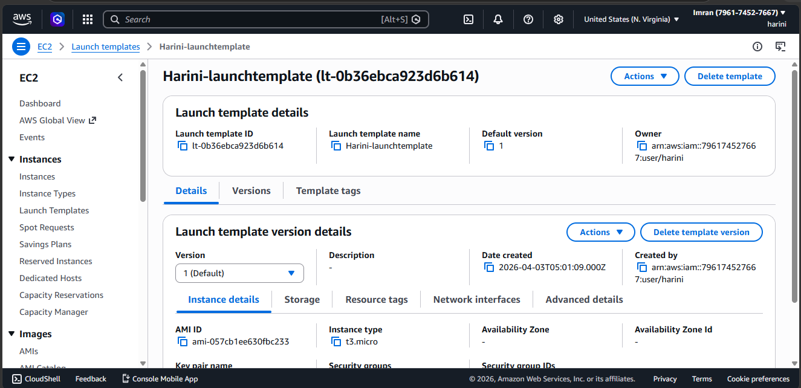

### Step 3: Secondary ENI (Advanced Requirement)

What is this?

Extra network interface

Used for:
Monitoring,
Logging,
Traffic isolation

Attach secondary network interface

Use for monitoring/logging traffic

### Step 4: Auto Scaling Group

Use Launch Template

Attach Placement Group

Min: 2

Desired: 2

Max: 6

## PHASE 4: STEP SCALING

Create CloudWatch Alarm

Scale Out:

Metric: CPU > 70%

Action: +2 instances

Scale In:

Metric: CPU < 25%

Action: -1 instance

## PHASE 5: AUTH SERVICE (LAMBDA)

### Step 1: Create Lambda Function

Runtime: Python 3.11

    def lambda_handler(event, context):
        return {
            'statusCode': 200,
            'body': 'Auth Service Working'
        }

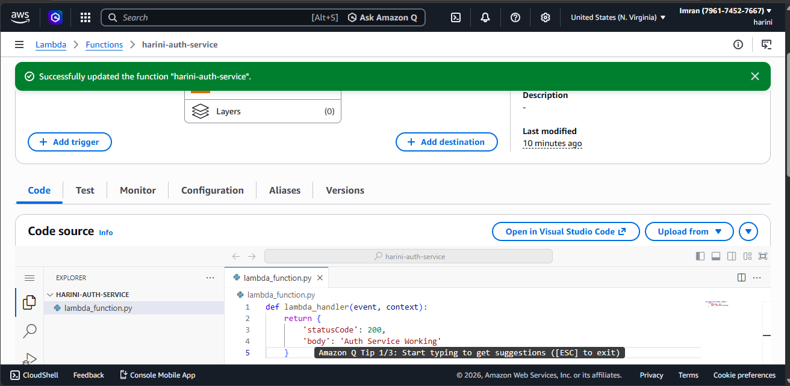

### Click Test

👉 Expected Output:

    {
      "statusCode": 200,
      "body": "Auth Service Working"
    }

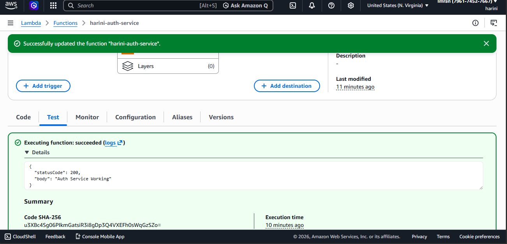

### Step 2: Create Target Group for Lambda

Target type: Lambda

Register function

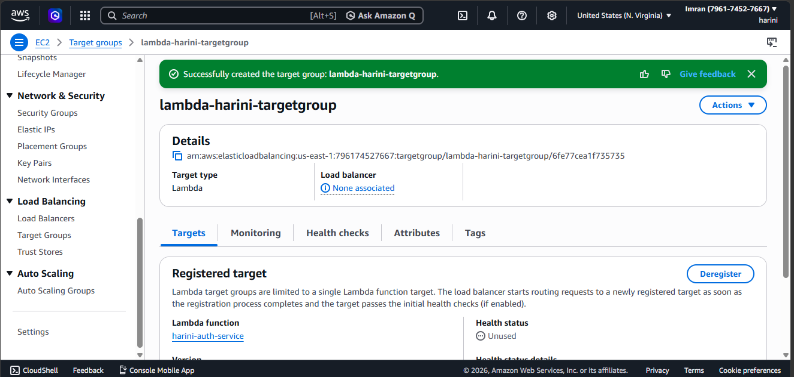

## PHASE 6: APPLICATION LOAD BALANCER

### Step 1: Create ALB

Scheme: Internet-facing

Subnets: Public subnets

### Step 2: Create Target Groups

1. EC2 Target Group

Type: Instance

Port: 80

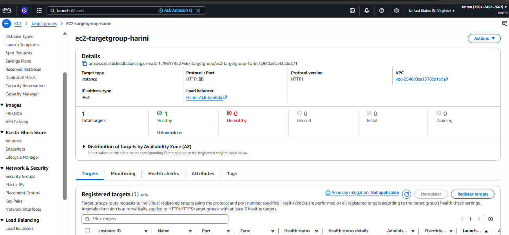

2. Lambda Target Group

Type: Lambda

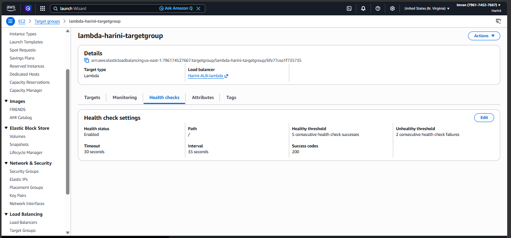

Step 3: Path-Based Routing

Path	Target

/users	EC2

/auth	Lambda

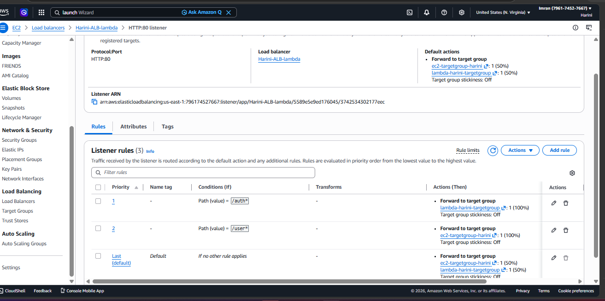

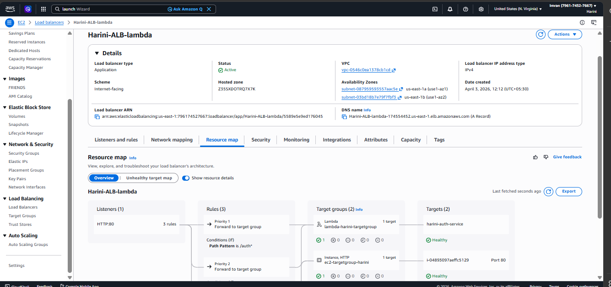

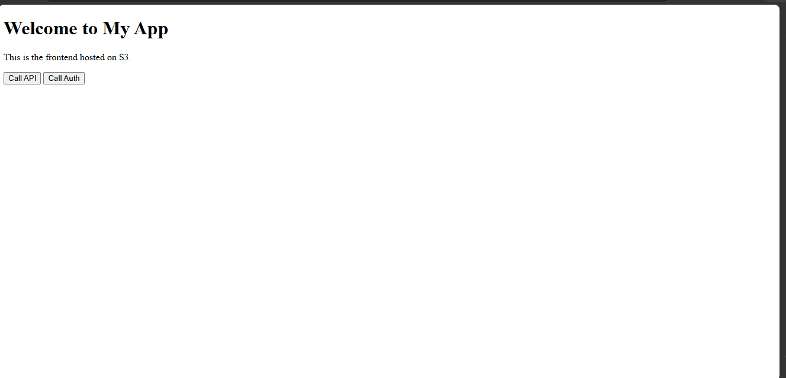

