# Java Web App Deployment on AWS EC2 + MySQL (Final Corrected)
 
## 1. Lab Objective
- Launch 2 EC2 instances
- Configure MySQL database
- Deploy Java Web App on Tomcat
- Connect App VM → DB VM
- Verify registration & login
 
## 2. Architecture Overview
App Server: App-vm

DB Server: DB-vm
 
Flow:
Browser → App VM (8080) → DB VM (3306)
 
## 3. Launch EC2 Instances
 
DB VM:
- Name: DB-VM

- Security Group:

 SSH (22) → My IP

MySQL (3306) → sg-app-vm

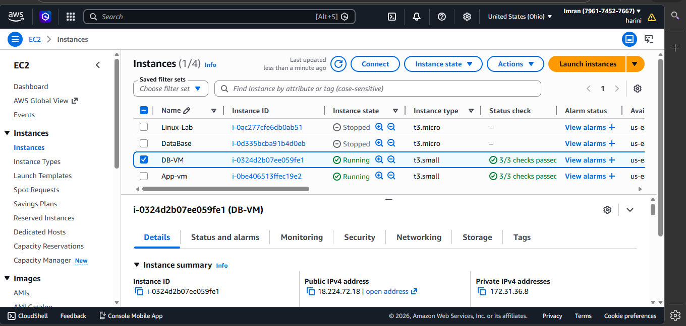
 
App VM:
- Name: App-vm

- Security Group:

 SSH (22) → My IP

HTTP (8080) → Anywhere

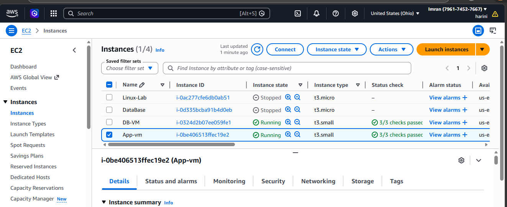
 
## 4. Configure DB VM
 
### Install MySQL:

    sudo apt update -y
    sudo apt install mysql-server -y
    sudo systemctl start mysql
    sudo systemctl enable mysql
 
 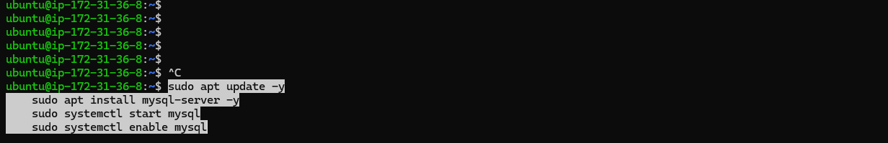

### Create Database:

    CREATE DATABASE jet;

    USE jet;
 
    Create Table:
    CREATE TABLE USER (
    id INT AUTO_INCREMENT PRIMARY KEY,
    first_name VARCHAR(50),
    last_name VARCHAR(50),
    email VARCHAR(100),
    username VARCHAR(50),
    password VARCHAR(50),
    regdate DATE
    );
 
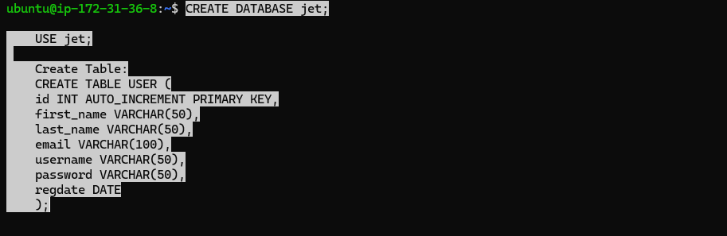

### Create User:

    CREATE USER 'appuser'@'%' IDENTIFIED BY 'YourPassword123!';

    GRANT ALL PRIVILEGES ON jet.* TO 'appuser'@'%';

    FLUSH PRIVILEGES;

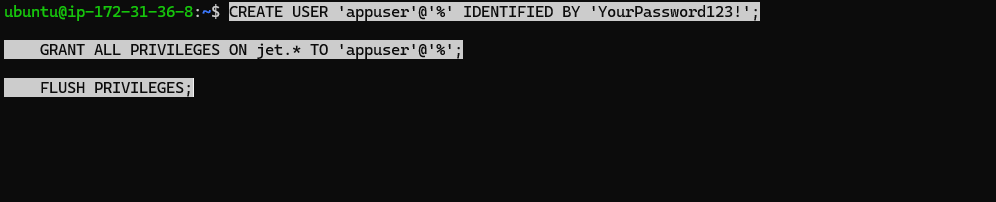 
 
### Enable Remote Access:

    sudo nano /etc/mysql/mysql.conf.d/mysqld.cnf
 
Change:

bind-address = 127.0.0.1
 
To:

bind-address = 0.0.0.0

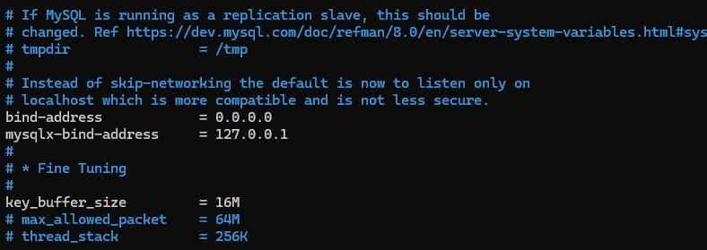
 
### Restart MySQL:

    sudo systemctl restart mysql
 
Verify:
sudo ss -tlnp | grep 3306

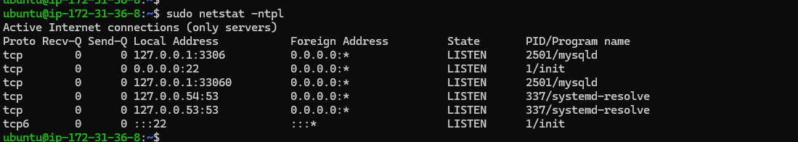
 
## 5. Configure App VM
 
### Install Java & Maven:

    sudo apt install openjdk-11-jdk -y

    sudo apt install maven -y

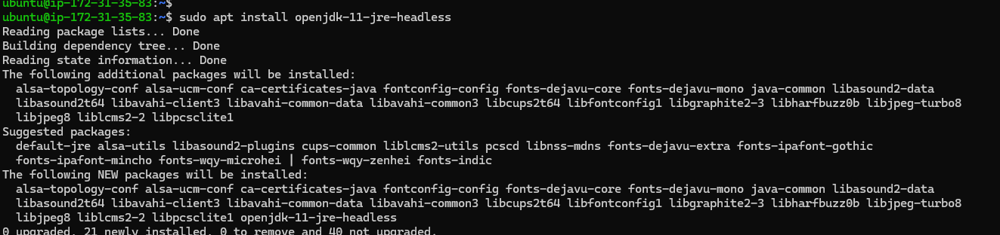

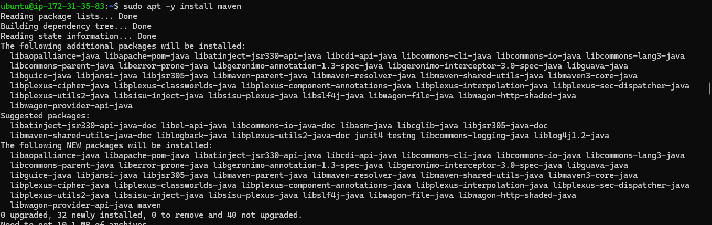

 
### Install Tomcat:

cd /opt

    wget https://downloads.apache.org/tomcat/tomcat-9/v9.0.91/bin/apache-tomcat-9.0.91.tar.gz

    tar -xvf apache-tomcat-9.0.91.tar.gz

    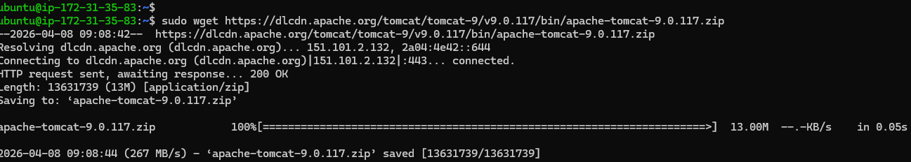

    mv apache-tomcat-9.0.91 tomcat9

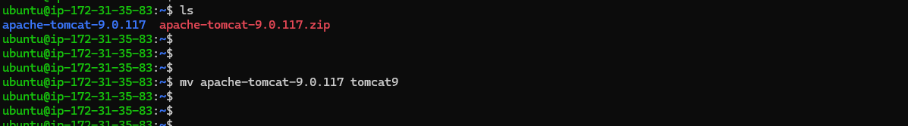

    chmod +x /opt/tomcat9/bin/*.sh
 
Fix Permissions:

    sudo chown -R ubuntu:ubuntu /opt/tomcat9
 
### Start Tomcat:

    sudo /opt/tomcat9/bin/startup.sh

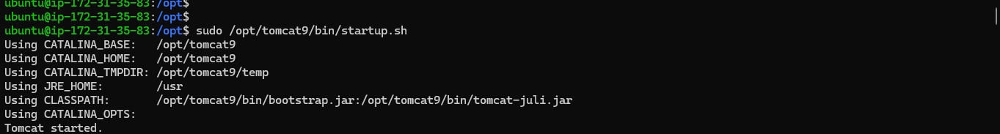
 
### Clone Project:

    git clone https://github.com/Akiranred/aws-rds-java.git

    cd aws-rds-java

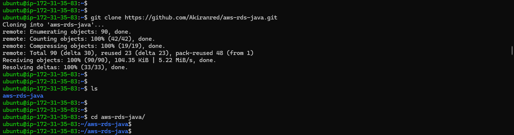
 
#### Update DB Connection in JSP:
 
Class.forName("com.mysql.cj.jdbc.Driver");
 
Connection con = DriverManager.getConnection(
"jdbc:mysql://<DB-PRIVATE-IP>:3306/jet?useSSL=false&allowPublicKeyRetrieval=true&serverTimezone=UTC",
"appuser",
"YourPassword123!"
);
 
### Build Project:

    mvn clean package

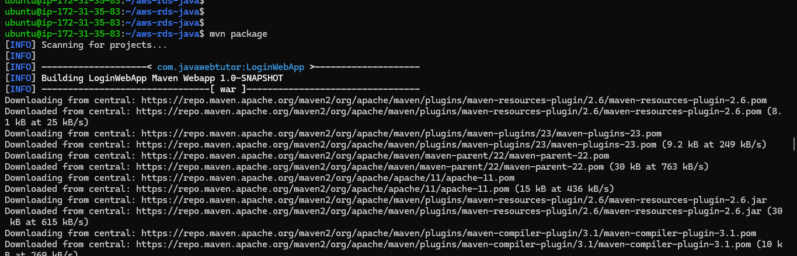   
 
### Deploy:

    sudo /opt/tomcat9/bin/shutdown.sh
    sudo rm -rf /opt/tomcat9/webapps/LoginWebApp*
    sudo cp target/LoginWebApp.war /opt/tomcat9/webapps/
    sudo /opt/tomcat9/bin/startup.sh

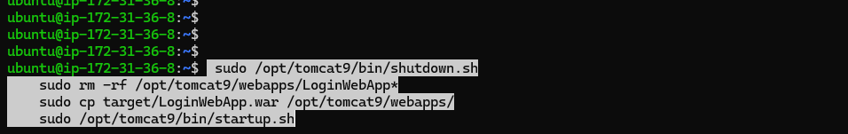
 
### Test Application:

    http://<APP-IP>:8080/LoginWebApp

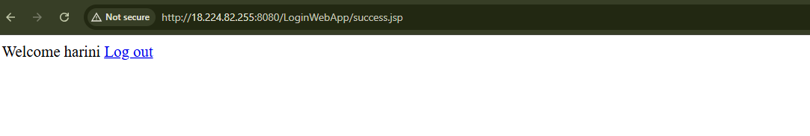
 
### Verify Data:

mysql -u appuser -p -e "SELECT * FROM jet.USER;"

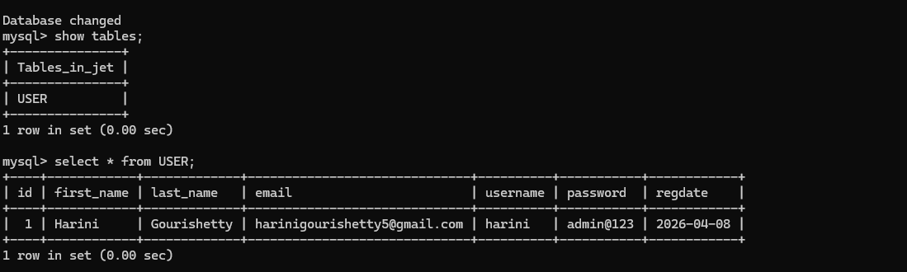
 
Summary:
- App deployed successfully
- DB connected
- Data stored and retrieved